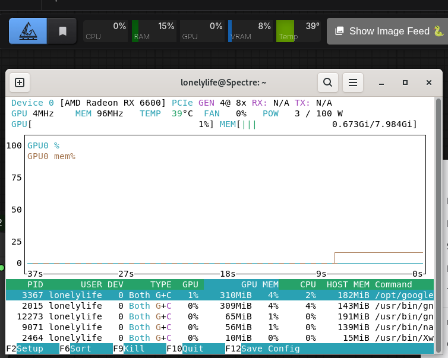

# comfyui-crystools (AMD Linux Fork)

This is a fork of [crystian/ComfyUI-Crystools](https://github.com/crystian/ComfyUI-Crystools) with added **AMD GPU monitoring support on Linux**.

> All original features are preserved. NVIDIA users are unaffected.

---

## What's different in this fork

The `general/gpu.py` file has been rewritten to support AMD GPUs on Linux using a multi-backend fallback system:

| Priority | Backend | Requires | Provides |
|---|---|---|---|
| 1 | pynvml | NVIDIA driver | GPU%, VRAM, Temp |
| 2 | pyrsmi | Full ROCm stack | GPU%, VRAM, Temp |
| 3 | pyamdgpuinfo | amdgpu kernel driver | GPU%, VRAM, Temp |
| 4 | **sysfs fallback** | **nothing extra** | GPU%, VRAM, Temp |
| 5 | jtop | Jetson only | GPU%, VRAM, Temp |

The **sysfs fallback** reads directly from `/sys/class/drm` — it works out of the box with any AMD card that has the `amdgpu` kernel driver, no extra packages needed.

---

## Installation

### Via ComfyUI Manager
Search for `crystools` and install. Then replace `general/gpu.py` with the one from this fork.

### Manual
```bash
cd ComfyUI/custom_nodes
git clone https://github.com/ProOrNoob/ComfyUI-Crystools.git ComfyUI-Crystools
cd ComfyUI-Crystools
pip install -r requirements.txt
```

### Optional — better AMD monitoring
```bash
# Provides more accurate GPU utilization (requires only amdgpu driver, not full ROCm)
pip install pyamdgpuinfo

# Full ROCm SMI (requires ROCm to be installed)
pip install pyrsmi
```

---

## Tested on

- AMD RX 6600 (RDNA2 / gfx1032)
- ROCm 7.2 / Debian Linux
- Crystools v1.27.4

---

## What you get

GPU%, VRAM, and Temperature visible in the ComfyUI resource monitor bar — same as NVIDIA users have always had.



---

## Original project

All credit for the original project goes to [crystian](https://github.com/crystian/ComfyUI-Crystools).  
This fork only adds AMD Linux support on top of the existing codebase.

A Pull Request has been submitted to the original repo:  
👉 https://github.com/crystian/ComfyUI-Crystools/pulls

*Patch fixed by Sonnet*
